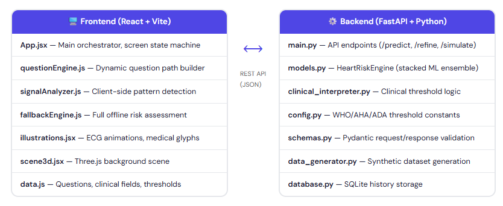
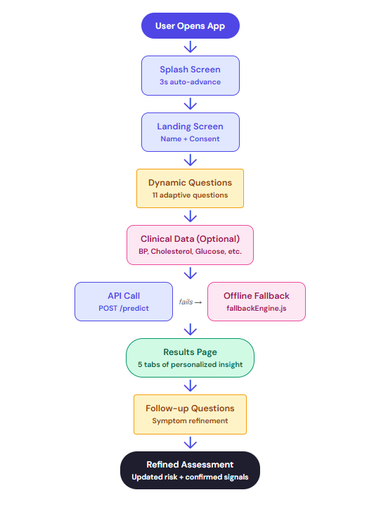
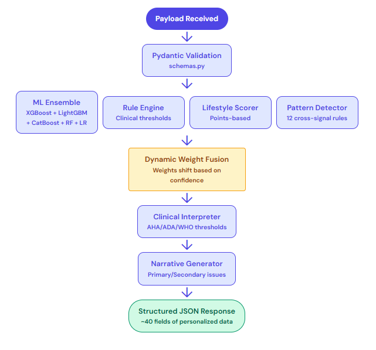
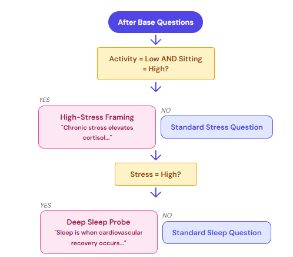
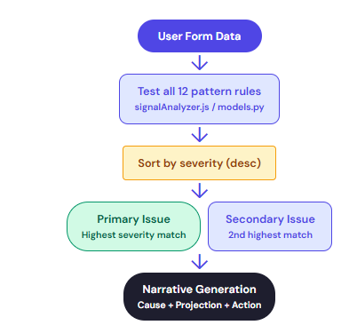
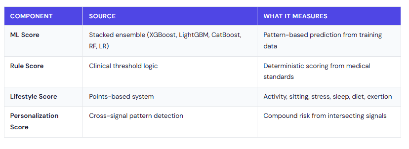
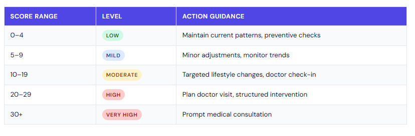
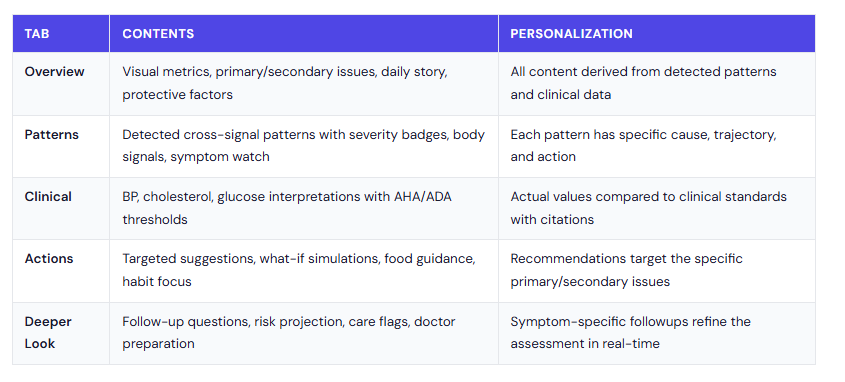

# 🚀 Beatly — AI Cardiovascular Assessment Engine

> A full-stack, data-driven system that delivers **personalized cardiovascular risk insights** using adaptive questioning, clinical standards, and machine learning.

---

## 🧠 Why Beatly?

Most health tools are static and generic.

Beatly is different.

It behaves like an **intelligent assessment system** that:
- Adapts questions in real time  
- Understands relationships between lifestyle and clinical signals  
- Combines ML predictions with medical guidelines  
- Produces explainable, personalized outputs  

---

## 🏗️ System Architecture

A modular full-stack system combining:

- **Frontend** → React + Vite (dynamic UI + visualizations)  
- **Backend** → FastAPI (API + clinical logic)  
- **ML Engine** → Ensemble models + pattern detection  
- **Storage** → SQLite for history tracking  

---

## 🔄 How It Works

1. User inputs basic information  
2. Questions adapt dynamically  
3. Optional clinical data improves accuracy  
4. ML + rule engine processes inputs  
5. Risk score + insights generated  
6. Follow-up questions refine results  

---

## ⚙️ Intelligence Pipeline

Every assessment passes through:

- Input validation  
- ML ensemble prediction  
- Clinical rule evaluation  
- Lifestyle scoring  
- Cross-signal pattern detection  
- Dynamic weight fusion  
- Narrative generation  

---

## 🧠 Adaptive Question Engine

- No fixed forms  
- Question path evolves after every answer  
- Context-aware branching  

👉 Example:  
Low activity + high sitting → deeper stress and recovery probing  

---

## 🔍 Pattern Detection System

Beatly identifies **hidden health patterns** by combining multiple signals:

- Lifestyle habits  
- Clinical indicators  
- Behavioral trends  

Each detected pattern includes:
- Severity  
- Cause  
- Risk trajectory  
- Actionable recommendations  

---

## 📊 Risk Scoring Model

Final score is computed using:

- ML prediction  
- Clinical thresholds  
- Lifestyle scoring  
- Pattern-based personalization  

👉 The system dynamically adjusts weights based on data confidence.

---

## 📈 Risk Levels

| Score | Level |
|------|------|
| 0–4 | Low |
| 5–9 | Mild |
| 10–19 | Moderate |
| 20–29 | High |
| 30+ | Very High |

---

## 📦 Output System

Beatly doesn’t just give a score.

It delivers:
- Primary & secondary risk insights  
- Clinical interpretation  
- Personalized recommendations  
- “What-if” simulations  
- Follow-up refinement  

---

## 🎯 Design Philosophy

- **Data-backed** → grounded in clinical standards  
- **Adaptive** → evolves with user input  
- **Explainable** → no black-box outputs  
- **Resilient** → works even if backend fails  

---

## 📴 Offline Fallback

If the backend is unavailable:
- Full assessment runs on frontend  
- Same scoring logic replicated  
- No interruption for the user  

---

## 🔌 API Endpoints

- POST /api/predict → Main assessment  
- POST /api/refine → Follow-up refinement  
- GET /api/history → Previous results  
- GET /api/health → System status  

---

## 📁 Project Structure

client/        → Frontend (React)  
server/        → Node proxy  
ml_engine/     → FastAPI + ML pipeline  

---

## ⚙️ Run Locally

npm install  
python -m uvicorn ml_engine.app.main:app --reload --port 8000  
npm --workspace server run dev  
npm --workspace client run dev  

---

## 📄 Detailed Documentation

For full technical details, architecture breakdown, and system design:

👉 [View Complete Documentation](./Beatly_Documentation.html)

---

## ⚠️ Disclaimer

This system is designed for **awareness and educational purposes only**.  
It is not a substitute for professional medical advice.

---

## 👤 Author

Chandan 
